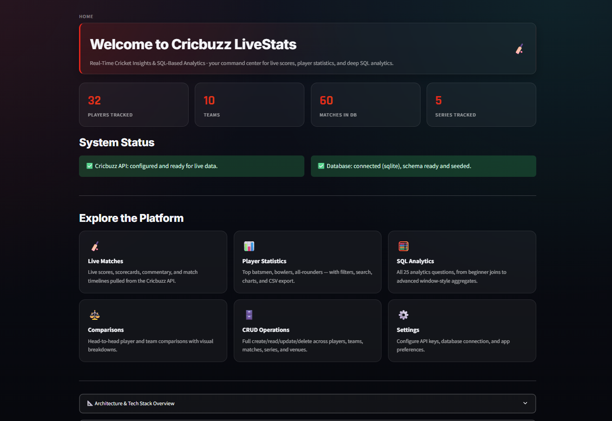
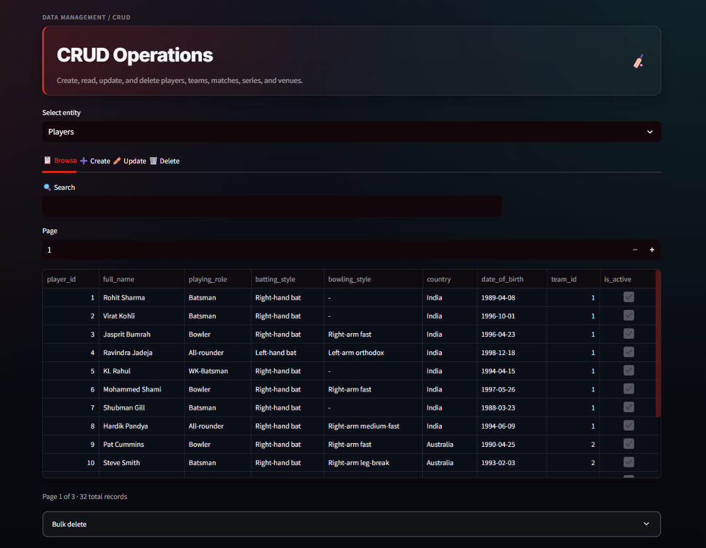
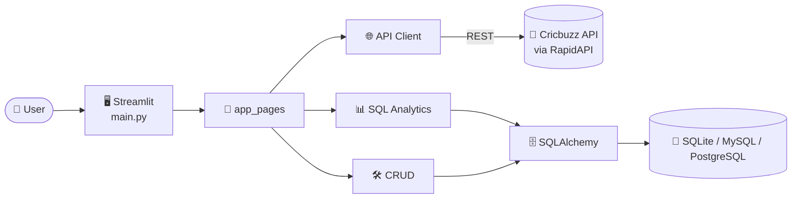

<div align="center">


<a href="https://git.io/typing-svg">
  
</a>

<br/><br/>


**A production-style sports analytics platform: live cricket data, a normalized SQL database, 25 hand-built SQL analytics questions, full CRUD management, and a premium Streamlit dashboard, all runnable locally in two commands.**

[🚀 Quick Start](#-quick-start) · [🐛 Report Bug](https://github.com/D0027/cricbuzz-livestats/issues) · [✨ Request Feature](https://github.com/D0027/cricbuzz-livestats/issues)

</div>

---

## 📑 Table of Contents

- [✨ Features](#-features)
- [📸 Screenshots](#-screenshots)
- [🏗️ Architecture](#️-architecture)
- [🧰 Tech Stack](#-tech-stack)
- [🚀 Quick Start](#-quick-start)
- [⚙️ Configuration](#️-configuration)
- [📁 Project Structure](#-project-structure)
- [🗄️ Database Design](#️-database-design)
- [📊 SQL Analytics](#-sql-analytics)
- [🧪 Testing](#-testing)
- [🌐 Deployment](#-deployment)
- [❓ FAQ](#-faq)
- [👨‍💻 Author](#-author)

---

## ✨ Features

<table>
<tr>
<td width="50%">

### 🏏 Live Matches
Live, upcoming, and completed matches, powered by the Cricbuzz API (with retries, caching, and timeouts).

### 📊 25 SQL Analytics Questions
8 Beginner, 8 Intermediate, and 9 Advanced queries. Each has syntax-highlighted SQL, a Run button, execution time, results, an auto chart, and CSV download.

### ⚔️ Head-to-Head Comparisons
Compare players and teams side by side.

</td>
<td width="50%">

### 👤 Player Statistics
Filter by role, explore stats, and see interactive charts.

### 🛠️ Full CRUD Management
Create, read, update, and delete records for 5 entities, with validated forms.

### 📥 Export Anywhere
Download results as **CSV** or **Excel**.

</td>
</tr>
<tr>
<td colspan="2" align="center">

### ⚡ Works Fully Offline
The database is created and **seeded automatically** on first run. Every page works out of the box, and live data switches on when you add a free Cricbuzz API key.

</td>
</tr>
</table>

---

## 📸 Screenshots

<!-- Save your screenshots in the assets/ folder with these names, or edit the paths below -->

<table>
<tr>
<td align="center" width="50%">
<br/>
<b>🏠 Home Dashboard</b>
</td>
<td align="center" width="50%">
<br/>
<b>🏏 Live Matches</b>
</td>
</tr>
<tr>
<td align="center">
<br/>
<b>👤 Player Statistics</b>
</td>
<td align="center">
<br/>
<b>📊 SQL Analytics</b>
</td>
</tr>
<tr>
<td align="center">
<br/>
<b>⚔️ Comparisons</b>
</td>
<td align="center">
<br/>
<b>🛠️ CRUD Management</b>
</td>
</tr>
</table>

---

## 🏗️ Architecture



---

## 🧰 Tech Stack

| Layer | Technology |
|---|---|
| 🖥️ Frontend | Streamlit (custom dark theme) |
| 🐍 Language | Python |
| 🗄️ ORM | SQLAlchemy |
| 💾 Database | SQLite (default) · MySQL · PostgreSQL |
| 📈 Data & Charts | Pandas · NumPy · Plotly |
| ✅ Validation | Pydantic |
| 🌐 Data Source | Cricbuzz Cricket API (RapidAPI) |
| 🧪 Testing | pytest |

---

## 🚀 Quick Start

```bash
# 1. Clone the repo
git clone https://github.com/D0027/cricbuzz-livestats.git
cd cricbuzz-livestats

# 2. Install dependencies
pip install -r requirements.txt

# 3. Run the app
streamlit run main.py
```

🌍 Open the URL Streamlit prints (usually **http://localhost:8501**).

> 💡 That's it. The database is created and seeded automatically on first run (SQLite file at `data/cricbuzz.db`).

---

## ⚙️ Configuration

Copy `.env.example` to `.env` and edit as needed:

```bash
cp .env.example .env          # Windows: copy .env.example .env
```

<details open>
<summary><b>🏏 Cricbuzz API (optional, only for the Live Matches page)</b></summary>

1. Sign up at [RapidAPI: Cricbuzz Cricket](https://rapidapi.com/cricbuzz-cricbuzz-default/api/cricbuzz-cricket)
2. Subscribe to the free tier and copy your API key
3. Set it in `.env`:

```env
CRICBUZZ_API_KEY=your_api_key_here
```

Without a key, every other page (Home, Player Statistics, SQL Analytics, Comparisons, CRUD) works normally on the seeded database. Only the live and upcoming tabs show a setup notice.

</details>

<details>
<summary><b>🗄️ Database (SQLite by default, MySQL / PostgreSQL optional)</b></summary>

`DB_TYPE` defaults to `sqlite` (zero setup). To use MySQL:

```env
DB_TYPE=mysql
DB_HOST=localhost
DB_PORT=3306
DB_NAME=cricbuzz_livestats
DB_USER=root
DB_PASSWORD=your_password
```

Run `database/schema_mysql.sql` against your MySQL instance first, or let the app's `init_db()` create the tables via SQLAlchemy (both give the same schema). For PostgreSQL, set `DB_TYPE=postgresql`.

</details>

> ⚠️ Never commit your real `.env` file. Keep secrets out of Git!

---

## 📁 Project Structure

```
cricbuzz_livestats/
├── main.py                  # Entry point: page config, sidebar nav, routing
├── api/
│   └── cricbuzz_client.py   # Cricbuzz REST API wrapper (retries, caching, timeouts)
├── database/
│   ├── models.py            # SQLAlchemy ORM models (8 tables, FKs, indexes)
│   ├── connection.py        # Engine/session management, raw query runner
│   ├── seed_data.py         # Realistic sample data generator
│   └── schema_mysql.sql     # Reference DDL + views for manual MySQL setup
├── models/
│   └── schemas.py           # Pydantic validation schemas for CRUD forms
├── analytics/
│   └── sql_queries.py       # All 25 SQL analytics questions + metadata
├── crud/
│   └── operations.py        # Generic CRUD functions for all 5 entities
├── utils/
│   ├── config.py            # Typed settings loaded from .env
│   ├── logger.py            # Rotating file + console logging
│   ├── ui.py                # Shared CSS/theme, KPI cards, headers, footer
│   └── exporters.py         # CSV / Excel export helpers
├── app_pages/
│   ├── home.py              # Landing dashboard
│   ├── live_matches.py      # Live / upcoming / completed matches
│   ├── player_stats.py      # Player statistics with filters + charts
│   ├── sql_analytics.py     # The 25-query analytics page
│   ├── comparisons.py       # Player & team head-to-head comparisons
│   ├── crud.py              # Create/Read/Update/Delete UI
│   ├── settings_page.py     # Configuration reference
│   └── about.py             # About / credits
├── tests/                   # pytest suite (DB, CRUD, all 25 queries, API client)
├── .streamlit/config.toml   # Dark theme configuration
├── .env.example             # Copy to .env and fill in your values
└── requirements.txt
```

---

## 🗄️ Database Design

**8 normalized tables**, with primary/foreign keys, unique constraints, and indexes on the most-queried columns (player role, match date, match/player lookups).

| Table | Purpose |
|---|---|
| 🏟️ `teams` | Cricket teams |
| 📍 `venues` | Grounds and stadiums |
| 🏆 `series` | Tournaments and series |
| 👤 `players` | Player profiles |
| 📈 `player_stats` | Career statistics |
| 🏏 `matches` | Match records |
| 🎯 `innings` | Innings details |
| ⭐ `performances` | Per-match player performances |

See `database/models.py` for the full schema and `database/schema_mysql.sql` for plain SQL with example views.

---

## 📊 SQL Analytics

**25 questions** across three difficulty levels:

| Level | Questions | Focus |
|---|:---:|---|
| 🟢 Beginner | 8 | Filters, sorting, basic aggregation |
| 🟡 Intermediate | 8 | Joins, grouping, subqueries |
| 🔴 Advanced | 9 | Complex analytics and window-style logic |

Every question ships with the **question, raw SQL (highlighted), a Run button, execution time, results table, an auto-generated chart where relevant, and a CSV download**.

---

## 🧪 Testing

```bash
pytest -v
```

Covers schema creation, seed data integrity, all CRUD operations, all 25 SQL queries running without error, and API client behavior when no key is configured.

```bash
# Just the SQL analytics tests
pytest tests/test_sql_queries.py -v
```

---

## 🌐 Deployment

- ☁️ **Streamlit Community Cloud:** push this repo to GitHub, point Streamlit Cloud at `main.py`, and add your `.env` values as **Secrets** (same key names).
- 🐳 **Docker / VM:**
```bash
  pip install -r requirements.txt && streamlit run main.py --server.port 8501 --server.address 0.0.0.0
```
- 🗄️ **MySQL / PostgreSQL in production:** provision the database first and set the `DB_*` env vars. The app creates tables on first boot if they don't exist.

---

## ❓ FAQ

<details>
<summary><b>Live Matches page shows "API key not configured"</b></summary>

Expected until you add `CRICBUZZ_API_KEY` to `.env`. Every other page works without it.

</details>

<details>
<summary><b>I get <code>sqlite3.OperationalError: unable to open database file</code></b></summary>

Make sure the `data/` folder is writable. Some hosting environments mount the working directory read-only, so set `DB_PATH` to a writable location.

</details>

<details>
<summary><b>How do I reset the sample data?</b></summary>

Delete `data/cricbuzz.db` and restart the app. It reseeds automatically.

</details>

<details>
<summary><b>Charts look empty on a query</b></summary>

Not every query has a natural chart (like wide comparison tables). Those intentionally show a table only.

</details>

---

## 🤝 Contributing

Contributions are welcome! Fork the repo, create a branch, and open a Pull Request 🎉

---

## 👨‍💻 Author

<div align="center">

**Deepak Yadav**

[](https://github.com/D0027)
[](https://linkedin.com/in/deepakyadav027)
[](https://d0027.github.io)

Data via the Cricbuzz Cricket API (RapidAPI).

⭐ **If you like this project, drop a star, it really helps!** ⭐

**Built with Python · Streamlit · SQLAlchemy · Pandas · Plotly · Pydantic**


</div>
